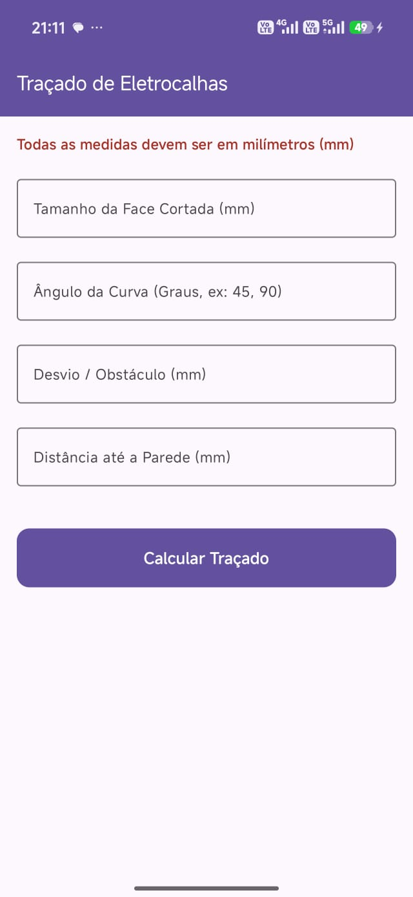
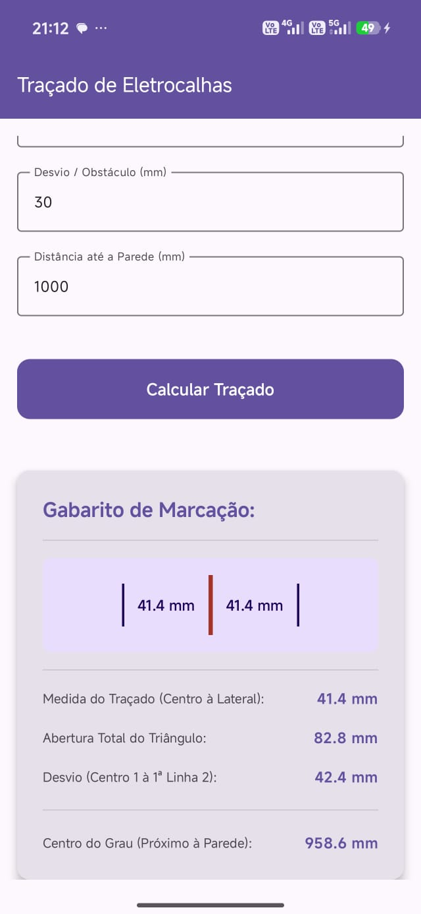

# 📐 Corte & Dobra Industrial

Uma aplicação Android desenvolvida para auxiliar profissionais da indústria a realizar cálculos rápidos e precisos para operações de corte e dobra. A ferramenta automatiza cálculos complexos de traçado, desvios e marcações, aumentando a produtividade e reduzindo a margem de erro no terreno.

## 🚀 Funcionalidades Principais

* **Cálculo do Traçado:** Determina a abertura total e o traçado com base no ângulo e face.
* **Cálculo do Desvio (Hipotenusa pura):** Calcula a distância para transpor obstáculos.
* **Desconto da Parede:** Define exatamente onde marcar o primeiro centro de corte.
* **Validação de Erros:** Feedback imediato no ecrã em caso de dados inválidos ou impossibilidade de cálculo.
* **Interface Reativa:** Os resultados atualizam instantaneamente à medida que os dados são introduzidos.

## 📸 Capturas de Ecrã

|                Ecrã Principal                 |             Resultados do Cálculo             |
|:---------------------------------------------:|:---------------------------------------------:|
|  |  |  

## 🛠️ Tecnologias e Arquitetura

O projeto foi desenvolvido nativamente para Android, utilizando as práticas modernas recomendadas para o ecossistema:

* **Linguagem:** [Kotlin](https://kotlinlang.org/)
* **Arquitetura:** MVVM (Model-View-ViewModel) com separação clara de responsabilidades.
* **Gestão de Estado:** Utilização de `StateFlow` e `UiState` para uma interface previsível e reativa (ex: `CalculatorUiState`).
* **UI:** Construído com [Jetpack Compose].

## 📝 Licença

Distribuído sob a licença MIT. Consulte o ficheiro `LICENSE` para mais informações.